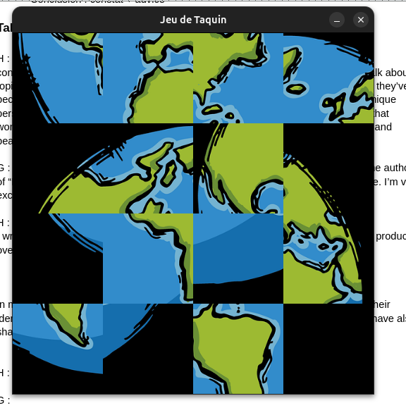

###Nom : Ony Brunella ANDRIATSAHAVOJAON

#Programmation C : TP11 - Jeu du taquin

##Qu'est-ce que le jeu du taquin

- Le jeu du taquin est un puzzle constitué de 15 pièces (grilles de 4*4) avec une case vide permettant de faire glisser les pièces adjacentes
- Le but du jeu est de remettre toutes les pièces à leur placeLe but est de programmer un jeu de taquin avec interface graphique où :

    Une image de 512x512 pixels est découpée en 16 cases (4x4).
    Une case vide est ajoutée pour permettre les mouvements.
    Le jeu est mélangé de manière résoluble.
    L'utilisateur doit remettre les pièces en ordre.


- d'abord on a fait la modélisation des structures
- initialisation des plateaux (initialiser le jeu avec les pièces ordonnées donc avant mélange)

- avant de faire le mélange, essayer de load l'image et d'en afficher les morceaux
-  Charger une image avec MLV_load_image.
    Créer une fenêtre avec MLV_create_window.
     Découper l’image en 4x4 morceaux.
    Afficher ces morceaux pour représenter le plateau de jeu.

    première difficulté était de découper une imgde 512*512 pixels sur la grille de 4x4 blocs (16) avec le 16e complètelent noir
    chaque bloc feront donc 512/4 = 128 pixels de côtés (TAILLE_CASE dans plateau.h)


au départ j'avais fait ça : 
```c

/* afficher plateau avec image et libMLV */
void AfficherPlateau(Plateau *P, MLV_Image *image) {
  int i, j;
  /* Nettoyer l'écran */
  MLV_clear_window(MLV_COLOR_BLACK);

  for (i = 0; i < NB_LIG; i++) {
      for (j = 0; j < NB_COL; j++) {
          /* Récupération des coordonnées de la pièce */
          /*mon erreur doit etre ici*/
          int lig_originale = P->bloc[i][j].lig;
          int col_originale = P->bloc[i][j].col;

          /* Coordonnées d’origine dans l’image */
          int src_x = col_originale * TAILLE_CASE;
          int src_y = lig_originale * TAILLE_CASE;

          /* Coordonnées de destination dans la fenêtre */
          int dest_x = j * TAILLE_CASE;
          int dest_y = i * TAILLE_CASE;

          /* Ne pas afficher la dernière case (case vide) */
          if (!(i == NB_LIG - 1 && j == NB_COL - 1)) {
              MLV_draw_partial_image(image, src_x, src_y, TAILLE_CASE, TAILLE_CASE, dest_x, dest_y);
          }
      }
  }
  MLV_actualise_window();
}
```
ps : j'ai pas utilisé 
MLV_get_pixel_on_image (récupération de la couleur d’un pixel dans une image ou-
verte)
• MLV_draw_pixel (dessiner un pixel particulier sur l’écran)
• MLV_convert_rgba_to_color (fabrication d’une couleur)

ces fonctions parce que sinon ça aurait pu etre chiant, un camarade de classe m'a dit d'utiliser ça (merci Paul), ça m'a évité un nb fou de temps perdu etde lignes de code inutile.

sauf que ça déforme l'img


finalement on problème est que j'avais inversé i et j ici dans INitialisationPlateau 

    Les coordonnées de chaque "petite image" sont calculées en fonction de la position de la case sur le plateau. Par exemple, la case située en ligne 1 et colonne 2 (carte d'origine) correspond à la portion de l'image située à src_x = 2 * 128 et src_y = 1 * 128.

Affichage des cases :

    La fonction MLV_draw_partial_image permet de dessiner une portion spécifique de l'image (découpée en 128x128) dans la fenêtre, à la position appropriée pour chaque case.
    La dernière case (qui est vide) n'est pas dessinée, car elle est représentée par une case vide dans le jeu de taquin.


Nettoyer l’écran

    Avant de dessiner l’image, on efface tout ce qu’il y a dans la fenêtre pour éviter les superpositions d’images.

Parcourir toutes les cases du plateau

    On parcourt chaque case du plateau (ligne par ligne, colonne par colonne).

    Chaque case contient une partie de l’image d’origine.

Déterminer quelle partie de l’image doit être affichée

    Chaque case correspond à une portion de l’image d’origine.

    Il faut donc découper l’image en petits morceaux de taille égale (ex. : 512 pixels / 4 = 128 pixels par case dans un plateau 4x4).

    Pour chaque case, on récupère sa position d’origine dans l’image.

Placer la portion d’image au bon endroit sur la fenêtre

    Chaque morceau d’image est affiché à l’emplacement qui correspond à sa position actuelle dans le plateau.

    On évite d’afficher la dernière case (la case vide) car elle doit rester invisible.

Actualiser la fenêtre

    Une fois toutes les cases affichées, on rafraîchit la fenêtre pour que les modifications apparaissent à l’écran.


#ensuite faut faire le mélange : On ne peut pas mélanger n’importe comment ! Il faut faire attention à faire des mélanges qui génère un plateau tjrs solvable : 

le mieux est de faire de légers mélanges c'est à a dire mélanger la case vide  avec un voisin et et de faire ces changements un certain nb de fois
On va faire 120 mouvements aléatoires valides à partir de la configuration finale (écrit dans le sujet)


Algorithme pour déplacer la case vide dans le plateau

L'objectif est de permettre à la case vide (en bas à droite dans la position finale) de s’échanger avec ses cases voisines directes, en respectant les règles du jeu

dans un premier temps, il faut que je trouve la case vide en parcourant tt le tableau pour la repérer, comme écrit dans le sujet du tp, Cette case est toujours celle qui a initialement les coordonnées (3,3) dans un plateau 4x4, donc j'ai pu vérifié par la uite avec un printf dans le main que c'est bien la case vide que j'ai selectionné et que j'ai stocké dans une varriable de type Carre.


1. Comprendre les positions possibles de la case vide

Le plateau est un tableau 4x4 avec des lignes et colonnes indexées de 0 à 3 :
(0,0)	(0,1)	(0,2)	(0,3)
(1,0)	(1,1)	(1,2)	(1,3)
(2,0)	(2,1)	(2,2)	(2,3)
(3,0)	(3,1)	(3,2)	(3,3)

La case vide a donc une position (lig_vide, col_vide) qui change à chaque déplacement.

2. Vérifier les déplacements possibles
Déplacement vers le haut (↑)

    Condition : La case vide ne doit pas être sur la première ligne (lig_vide > 0).

    Explication : Si elle est sur la ligne 0, elle ne peut pas monter, sinon elle sort du plateau.

    Action : Elle échange sa place avec la case située juste au-dessus (lig_vide - 1).

    Exemple :

        Si la case vide est en (2,2), elle peut monter et échanger avec (1,2).

        Mais si elle est en (0,2), elle ne peut pas monter.

Déplacement vers le bas (↓)

    Condition : La case vide ne doit pas être sur la dernière ligne (lig_vide < 3).

    Explication : Si elle est sur la ligne 3, elle ne peut pas descendre.

    Action : Elle échange sa place avec la case juste en dessous (lig_vide + 1).

    Exemple :

        Si la case vide est en (1,1), elle peut descendre et échanger avec (2,1).

        Mais si elle est en (3,1), elle ne peut pas descendre.

Déplacement vers la gauche (←)

    Condition : La case vide ne doit pas être sur la première colonne (col_vide > 0).

    Explication : Si elle est sur la colonne 0, elle ne peut pas aller à gauche.

    Action : Elle échange sa place avec la case juste à gauche (col_vide - 1).

    Exemple :

        Si la case vide est en (2,2), elle peut aller à gauche et échanger avec (2,1).

        Mais si elle est en (2,0), elle ne peut pas aller à gauche.

Déplacement vers la droite (→)

    Condition : La case vide ne doit pas être sur la dernière colonne (col_vide < 3).

    Explication : Si elle est sur la colonne 3, elle ne peut pas aller à droite.

    Action : Elle échange sa place avec la case juste à droite (col_vide + 1).

    Exemple :

        Si la case vide est en (1,1), elle peut aller à droite et échanger avec (1,2).

        Mais si elle est en (1,3), elle ne peut pas aller à droite.

avant fonction MelangerPlateau : 
après fonction MelanerPlateau : 
-> sauf que lors de la compilation, le plateau a la mm tete tout le temps, nous voulons pourtant des mélanges aléatoires, alors on rajoute srand(time(NULL)); pour rendre les déplacements dans MelangerPLeateau complètement aléaloires

POur l'instant, j'ai réussi à tout mélanger SAFU mélanger par rapport au carré noir, donc il est tjrs à sa place : 


mon problème était dans cette condition :  /*if (!(i == NB_LIG - 1 && j == NB_COL - 1)) {*/
       celle ci est meilleure   if (!(lig_originale == NB_LIG - 1 && col_originale == NB_COL - 1)) {

- Donc quand on mélange le jeu, cette case vide se déplace, mais on veut toujours la cacher.
- La condition if (!(lig_originale == NB_LIG - 1 && col_originale == NB_COL - 1)) vérifie si la pièce actuelle n'est pas la case vide. Si c'est le cas (la pièce n'est pas la case vide), alors elle est affichée. Sinon, elle est ignorée.

Sauf que La condition (i == NB_LIG - 1 && j == NB_COL - 1) vérifie les coordonnées actuelles dans le plateau (grille). Le problème c'était que les pièces sont mélangées et leurs positions actuelles peuvent changer (par rapport à cette case vide) donc c'est pour ça c'était pas bien, du coup la position de la case vide qui était en (3,3) bah va changer 

Vous avez parfaitement raison, et votre explication est excellente. Résumons cela pour bien clarifier :

1. Le problème initial :
   - La condition (i == NB_LIG - 1 && j == NB_COL - 1) ne fonctionnait pas correctement.
   - Elle vérifiait la position actuelle dans la grille, qui change après le mélange.

2. Pourquoi c'était problématique :
   - La case vide, initialement en (3,3), se déplace lors du mélange.
   - Mais cette condition cherchait toujours la case vide en (3,3), même après le mélange.

3. La solution :
   - Utiliser (lig_originale == NB_LIG - 1 && col_originale == NB_COL - 1).
   - Cela vérifie les coordonnées originales de la pièce dans l'image source.
   - Ces coordonnées ne changent pas, même quand la pièce se déplace dans le jeu.

voici donc ma nouvelle fonction pour afficher le plateau
```c
void AfficherPlateau(Plateau *p, MLV_Image *img) {
  int i, j;
  /* Nettoyer l'écran */
  MLV_clear_window(MLV_COLOR_BLACK);

  for (i = 0; i < NB_LIG; i++) {
      for (j = 0; j < NB_COL; j++) {
          /* Récupération des coordonnées de la pièce */
          /*int lig_originale = P->bloc[i][j].lig;
          int col_originale = P->bloc[i][j].col;*/

          int lig_originale = p->bloc[i][j].lig;
          int col_originale = p->bloc[i][j].col;

          /* Coordonnées d’origine dans l’image */
          int src_x = col_originale * TAILLE_CASE;
          int src_y = lig_originale * TAILLE_CASE;
          /* Coordonnées de destination dans la fenêtre */
          int dest_x = j * TAILLE_CASE;
          int dest_y = i * TAILLE_CASE;

          /* Ne pas afficher la dernière case (case vide) */
          /*if (!(i == NB_LIG - 1 && j == NB_COL - 1)) {*/
          if (!(lig_originale == NB_LIG - 1 && col_originale == NB_COL - 1)) {
              MLV_draw_partial_image(img, src_x, src_y, TAILLE_CASE, TAILLE_CASE, dest_x, dest_y);
          } else{
            printf("Case vide en : (%d, %d)\n", i, j);
          }
      }
  }
  MLV_actualise_window();
}
```

4. Mouvement de la case vide

La case vide (celle qui peut se déplacer) peut être déplacée en fonction des clics de souris de l'utilisateur. La fonction MLV_wait_mouse récupère les coordonnées de la souris et vous permet de savoir où l'utilisateur a cliqué.


explications de ma fonction GererClicSouris : 

```c
/*fonction pour gerer clis de souris*/
void GererClicSouris(Plateau *p, MLV_Image *img){
  int x,y;
  /*attendre que l'user clique sur le bouton gauche de sa souris*/
  MLV_wait_mouse(&x, &y);
  int lig = y / TAILLE_CASE; 
  int col = x / TAILLE_CASE; 

  Carre case_vide = TrouverCaseVide(p);
  int lig_case_vide = case_vide.lig;
  int col_case_vide = case_vide.col;

  if ((lig == lig_case_vide && abs(col - col_case_vide) == 1) || (col == col_case_vide && abs(lig - lig_case_vide) == 1)) {
    /*échanger les pièces */
    Carre temp = p->bloc[lig][col];
    p->bloc[lig][col] = p->bloc[lig_case_vide][col_case_vide];
    p->bloc[lig_case_vide][col_case_vide] = temp;
  }
  AfficherPlateau(p, img);
}
```

d'abord, la fonction récupère les coordonnées du clic du user avec : MLV_wait_mouse(&x, &y);
- ensuite on calcule lig et col avec  int lig = y / TAILLE_CASE;  et int col = x / TAILLLE_CASE
- ensuite, on  identifie où se trouve la case vide avec  : 
- Carre case_vide = TrouverCaseVide(plateau); 
int lig_case_vide = case_vide.lig;         
int col_case_vide = case_vide.col;        
- ensuite, on vérifie si le clic est valide, c'est à dire si la pièce cliquée est adjacente à la case vide 
    lig == lig_case_vide: Vérifie si la pièce cliquée est sur la même ligne que la case vide.

    abs(col - col_case_vide) == 1: Vérifie si la pièce cliquée est dans une colonne adjacente à celle de la case vide.

    col == col_case_vide: Vérifie si la pièce cliquée est dans la même colonne que la case vide.

    abs(lig - lig_case_vide) == 1: Vérifie si la pièce cliquée est dans une ligne adjacente à celle de la case vide.


En d'autres mots, La pièce doit être sur la même ligne que la case vide, mais dans une colonne adjacente. ou bien, elle doit être dans la même colonne que la case vide, mais dans une ligne adjacente. Si cette condition est vraie, le mouvement est valide.


ensuite, on échange les positions de la pièce cliquée avec celle de la case vide.
Carre temp = plateau->bloc[lig][col];                      
plateau->bloc[lig][col] = plateau->bloc[lig_case_vide][col_case_vide];
plateau->bloc[lig_case_vide][col_case_vide] = temp;             


et ensuite, on met à jourl'affichage du plateau avec : AfficherPlateau(plateau, img); 


5. Vérification de la victoire

Le jeu est terminé lorsque toutes les cases sont dans l'ordre. Il faut donc vérifier à chaque mouvement si l'état du plateau correspond à l'état final.
int verifieVictoire(Plateau *P) {
    for (int i = 0; i < NB_LIG; i++) {
        for (int j = 0; j < NB_COL; j++) {
            if (P->bloc[i][j].lig != i || P->bloc[i][j].col != j) {
                return 0; // Le jeu n'est pas terminé
            }
        }
    }
    return 1; // Victoire
}

void afficherVictoire() {
    MLV_draw_text(200, 200, "Vous avez gagné !", MLV_COLOR_WHITE);
    MLV_actualise_window();
    MLV_wait_seconds(3);
}


Mélanger les pièces de façon résoluble.
Gérer les mouvements du joueur avec la souris.
Vérifier si la partie est gagnée.