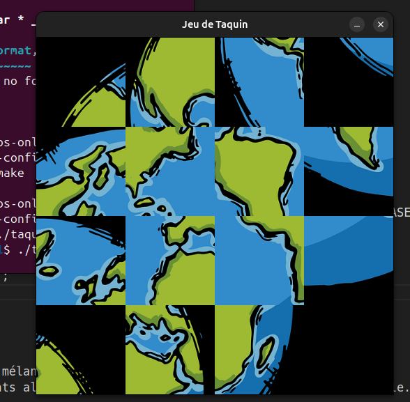
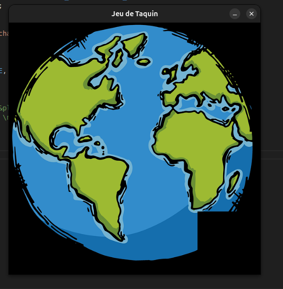
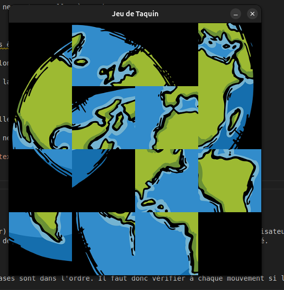

# Jeu du Taquin

### Ony Brunella ANDRIATSAHAVOJAON

## Présentation du jeu

Le jeu du taquin est un puzzle classique composé de 15 pièces disposées sur une grille de 4×4 (dans ce cas-là), avec une case vide permettant de faire glisser les pièces adjacentes. L'objectif est de reconstituer l'image complète en remettant toutes les pièces dans leur position initiale.

- Une image de 512×512 pixels est découpée en 16 cases (4×4)
- La 16ème case est laissée vide pour permettre les mouvements
- Le jeu est mélangé de manière à toujours rester résoluble
- Le joueur doit réorganiser les pièces en utilisant la souris

## Développement technique

### Modélisation et initialisation

J'ai commencé par définir les structures de données nécessaires, notamment la structure `Plateau` représentant le jeu et la structure `Carre` pour chaque pièce du puzzle. L'initialisation du plateau place les pièces dans leur position ordonnée avant le mélange mélange.

### Affichage graphique avec MLV

L'interface graphique utilise la bibliothèque MLV pour :
- Charger l'image source avec `MLV_load_image`
- Créer une fenêtre de jeu avec `MLV_create_window`
- Découper l'image en 16 morceaux de 128×128 pixels chacun
- Afficher ces morceaux pour représenter l'état actuel du plateau

La première difficulté a été le découpage de l'image de 512×512 pixels en blocs individuels. Chaque bloc fait exactement 128 pixels de côté (défini par `TAILLE_CASE` dans `plateau.h`).

### Correction d'un bug d'affichage

J'ai rencontré un problème d'affichage qui déformait l'image :



Après analyse, j'avai identifié que j'avais inversé les variables `i` et `j` dans la fonction `InitialisationPlateau` (oops).

### Logique d'affichage

Pour afficher correctement le plateau :
1. Je nettoie d'abord l'écran pour éviter les superpositions
2. Je parcours chaque case du plateau ligne par ligne et colonne par colonne
3. Pour chaque case, je détermine quelle portion de l'image d'origine doit être affichée
4. Je place cette portion au bon endroit sur la fenêtre
5. Je n'affiche pas la case vide (dernière case)
6. J'actualise la fenêtre après avoir dessiné toutes les cases

### Algorithme de mélange

Un point important du jeu est la génération d'un mélange résoluble. Pour cela, il fallait implémenté un mélange par déplacements aléatoires valides :
- Je pars de configuration finale (ordonnée)
- J'effectue 120 mouvements aléatoires de la case vide avec ses voisins directs
- `srand(time(NULL))` pour que chaque mélange soit différent à chaque partie

Les images ci-dessous montrent le plateau avant et après le mélange :




### Gestion de la case vide

Un défi important concernait l'affichage de la case vide lors des déplacements. J'ai dû corriger ma condition de test :

```c
/* Condition incorrecte qui ne fonctionnait pas après mélange */
if (!(i == NB_LIG - 1 && j == NB_COL - 1)) {
    // Afficher la pièce
}

/* Condition correcte qui fonctionne même après mélange */
if (!(lig_originale == NB_LIG - 1 && col_originale == NB_COL - 1)) {
    // Afficher la pièce
}
```

La première condition vérifiait la position actuelle dans la grille, alors que la seconde vérifie les coordonnées originales de la pièce, qui ne changent pas même quand la pièce se déplace dans le jeu.

### Interaction avec la souris

La fonction `GererClicSouris` permet au joueur d'interagir avec le jeu :
1. Elle attend un clic de souris avec `MLV_wait_mouse(&x, &y)`
2. Elle convertit les coordonnées du clic en position sur la grille
3. Elle identifie où se trouve la case vide
4. Elle vérifie si le clic est valide (pièce adjacente à la case vide)
5. Si le mouvement est valide, elle échange les positions de la pièce cliquée avec celle de la case vide
6. Elle actualise l'affichage

Un mouvement est valide si la pièce cliquée est :
- Sur la même ligne que la case vide et dans une colonne adjacente, OU
- Dans la même colonne que la case vide et dans une ligne adjacente

### Vérification de la victoire

Après chaque mouvement, le jeu vérifie si toutes les pièces sont à leur place. Si c'est le cas, un message de victoire s'affiche et la partie se termine après quelques secondes.